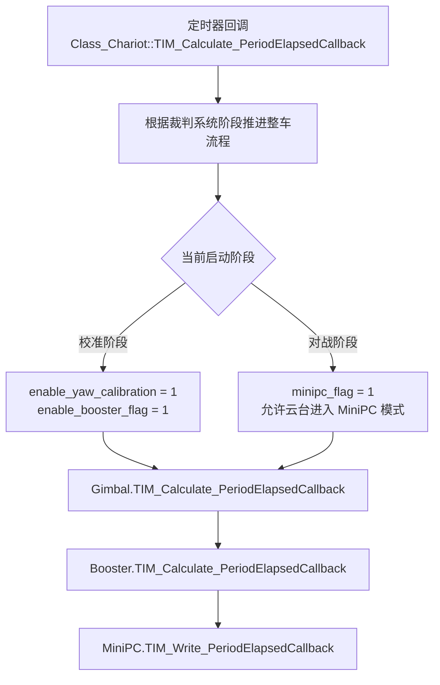
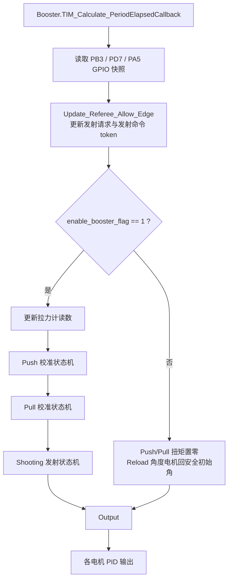
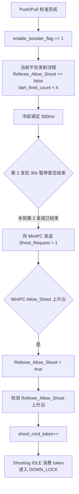
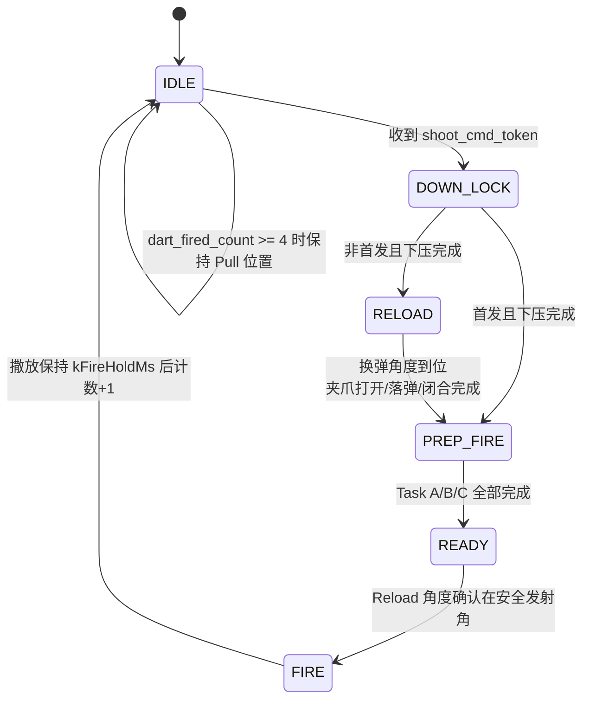
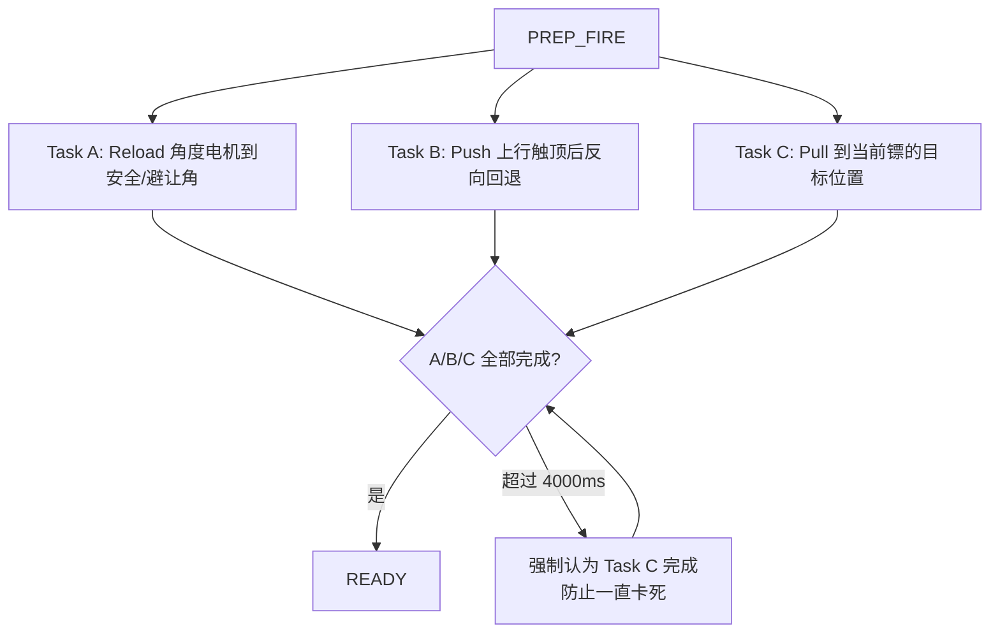
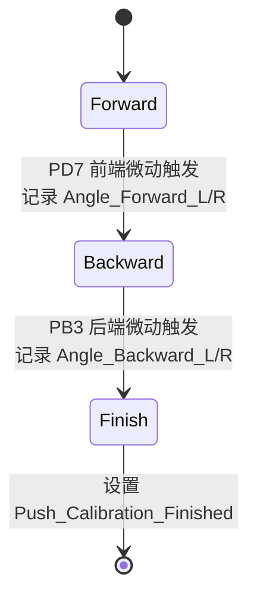
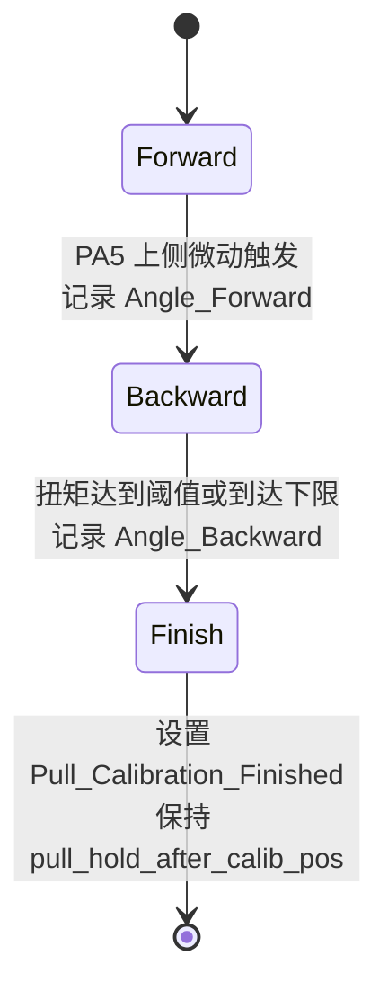
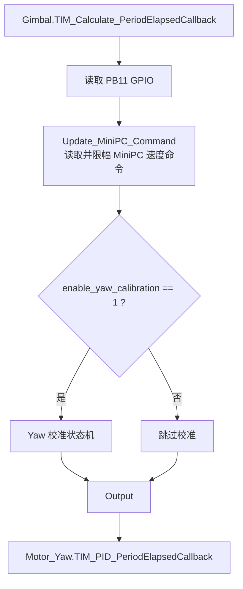
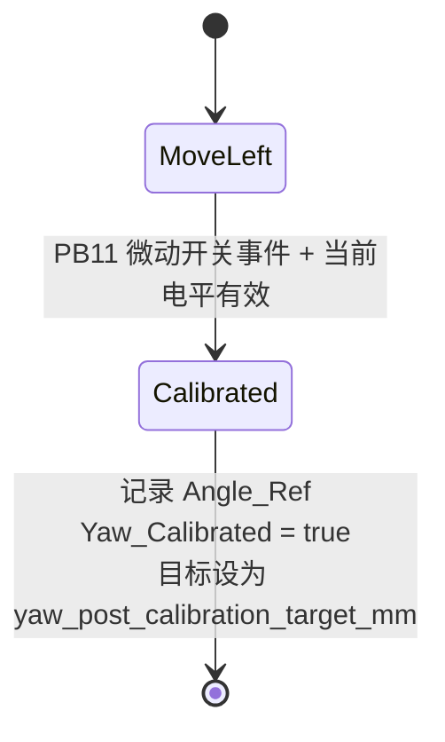
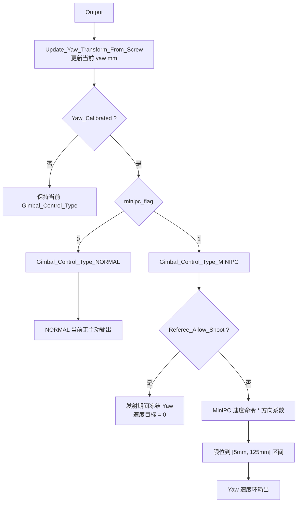

# Chariot Booster / Gimbal 控制流程说明

本文档用于帮助后续维护者快速理解 `User/Chariot/Src/crt_booster.cpp` 与 `User/Chariot/Src/crt_gimbal.cpp` 的主逻辑。重点不是逐行解释代码，而是说明模块之间如何协作、关键状态如何流转、哪些变量承担跨模块语义。

## 代码范围

  

核心文件：

  

- `User/Chariot/Inc/crt_booster.h`：发射机构类、发射状态机、Push/Pull 校准状态机的声明。

- `User/Chariot/Src/crt_booster.cpp`：发射机构主逻辑、发射状态机、Push/Pull 校准、发射许可边沿检测。

- `User/Chariot/Inc/crt_gimbal.h`：云台类、Yaw 校准状态机的声明。

- `User/Chariot/Src/crt_gimbal.cpp`：Yaw 校准、MiniPC 速度命令转换、Yaw 输出限位。

- `User/Interaction/Src/ita_chariot.cpp`：整车调度入口，负责设置 `enable_booster_flag`、`enable_yaw_calibration`、`minipc_flag`，并周期调用 Gimbal / Booster。

  

## 全局调度关系

  

`Class_Chariot::TIM_Calculate_PeriodElapsedCallback()` 是这套逻辑的上层周期入口。它根据比赛阶段推进系统状态，并在每个周期调用 Gimbal 和 Booster 的定时计算函数。

  

  

几个入口标志的含义：

  

- `enable_yaw_calibration`：允许 Yaw 校准状态机运行。

- `enable_booster_flag`：允许 Booster 执行校准、发射状态机；为 0 时 Push/Pull 停机，Reload 角度电机保持安全初始角。为1时正常工作。
- `minipc_flag`：Yaw 校准完成后，决定 Gimbal 在普通模式还是 MiniPC 速度控制模式。

- `Referee_Allow_Shoot`：发射流程的核心许可位，同时也被 Gimbal 用来在发射期间冻结 Yaw。

  

## Booster 总体结构

  

发射机构主要由四类对象组成：

  

- `Motor_Pull`：拉力/拉弦方向电机，当前发射准备 Task C 使用位置环。

- `Motor_Push_L` / `Motor_Push_R`：上膛/下压用双 Push 电机。

- `Motor_Reload_Angle`：GM6020 换弹角度电机。

- `Servo_Trigger` / `Servo_Claw[3]`：撒放器舵机和三路夹爪舵机。

  

Booster 每个周期主要做五件事：

  

  

## 发射许可与 MiniPC 握手

  

发射不是直接由某个布尔量触发，而是通过 `Referee_Allow_Shoot` 的上升沿生成 `shoot_cmd_token`。状态机只消费 token，这样可以避免同一个高电平在多个周期里重复触发。

  

  

保护逻辑：

  

- `REFEREE_ALLOW_SHOOT_MAX_COUNT = 4`，超过 4 次许可上升沿后会清掉 `Referee_Allow_Shoot`。

- 第 2 发完成后，`DART_MID_PAUSE_MS = 30000`，暂停 30s 再允许后续发射请求。

- 单发结束后 `Referee_Allow_Shoot = false`，等待下一次 MiniPC 许可上升沿。

  

## Shooting 发射状态机

  

当前实际发射流程集中在 `Class_FSM_Shooting::Shooting_TIM_Status_PeriodElapsedCallback()`，换弹动作也被整合进这个大状态机里。`Class_FSM_Reload` 仍保留类和枚举，但当前没有使用，是上版本的残留物。

  

  

### IDLE

  

作用：

  

- 撒放器保持打开角 `tirrger_fire_angle`，便于后续下压时触碰微动开关。

- `Reload_Status` 置为 `FINISHED`。

- 如果收到未消费的 `shoot_cmd_token`，进入 `DOWN_LOCK`。

- 如果已经打满 4 发，Pull 电机保持在 `pull_hold_after_calib_pos`。

  

### DOWN_LOCK

  

作用：

  

- Push 左右电机向下运动，直到 PB3 后端微动开关触发。

- 触发后 Push 停止，撒放器闭合到 `tirrger_reset_angle`。

- 等待 `kDownLockServoCloseDelayMs = 500ms`，确保机构扣住。

- 首发直接进入 `PREP_FIRE`；非首发进入 `RELOAD`。

  

### RELOAD

  

作用：

  

- GM6020 转到当前镖对应的 `kReloadAngleRad[reload_index]`。

- 到位后延迟 `kReloadClawOpenDelayMs = 800ms`，打开对应夹爪。

- 再延迟 `kReloadDropDelayMs = 1500ms`，关闭全部夹爪。

- 更新 `reload_count`，然后进入 `PREP_FIRE`。

  

换弹角度表：

  

- `kReloadAngleRad`：实际落弹/换弹角。

- `kEludeAngleRad`：非首发准备发射时的安全避让角。

- 两张表均按镖序号索引。

  

### PREP_FIRE

  

准备发射由三个并行任务共同决定：

  

  

Task 细节：

  

- Task A：`Motor_Reload_Angle` 进入角度环，目标是首发初始安全角或非首发避让角。

- Task B：Push 上行直到 PD7 前端微动触发，记录顶部位置，再反向回退 `kPushBackoffDistance = 0.006m`。

- Task C：Pull 使用位置环，目标来自 `pull_position_task_C[4] = {0.39, 0.40, 0.42, 0.45}`。

  

注意：代码中保留了拉力闭环 `Pull_Tension_Control()`，但当前 PREP_FIRE 的 Task C 实际走的是位置环版本，拉力闭环逻辑被注释掉。

  

### READY

  

作用：

  

- 撒放器保持闭合。

- Push 左右电机速度目标为 0。

- Reload 角度电机继续保持发射安全角。

- 当 Reload 角度误差小于 `kSafeAngleTolerance = 0.002rad`，进入 `FIRE`。

  

### FIRE

  

作用：

  

- 第一次进入时撒放器打开发射。

- 保持 `kFireHoldMs = 500ms`。

- `dart_fired_count++`，`shooting_cycle_active = false`，`Referee_Allow_Shoot = false`。

- 回到 `IDLE` 等待下一次发射许可。

  

## Push 校准状态机

  

Push 校准用于建立双 Push 电机前后极限位置，并把电机角度映射为归一化行程。

  

  

主要点：

  

- 前进阶段使用 PD7 作为前端触发。

- 后退阶段使用 PB3 作为后端触发。

- 进入每个状态第一帧会消费一次旧 EXTI 事件，避免跨状态误触发。

- 完成后将 Push 左右电机切到角度环并保持目标位置。

  

## Pull 校准状态机

  

Pull 校准用于建立拉力电机上下极限位置。

  

  

主要点：

  

- PA5 是 Pull 上侧微动开关。

- `Torque_Threshold` 用于辅助判断下侧极限。

- 完成后 `pull_hold_after_calib_pos` 作为校准后的默认保持位置，也会在发射流程的 DOWN_LOCK / RELOAD 中使用。

  

## Gimbal 总体结构

  

当前 Gimbal 主要实际控制 Yaw 轴。Pitch 电机对象仍保留，因为外部 CAN 接收和 Alive 检测仍会访问 `Motor_Pitch_L/R`，但当前 `crt_gimbal.cpp` 没有对 Pitch 做输出控制。

  

Gimbal 每周期做三件事：

  

  

## Yaw 校准状态机

  

  

校准逻辑：

  

- Yaw 先以 `-speed` 向左运动。

- PB11 中断事件和 PB11 当前电平均有效时，停止电机并记录 `Angle_Ref`。

- 进入完成态后，调用 `Update_Yaw_Transform_From_Screw()`，用丝杆模型把编码器角度映射成 mm。

- 设置 `Yaw_Calibrated = true`，控制模式切到 `Gimbal_Control_Type_NORMAL`，目标位置设为 `yaw_post_calibration_target_mm`。

  

## Gimbal 输出模式

  

  

MiniPC 命令转换：

  

- `MiniPC_Command_Speed_Raw` 来自 `MiniPC->Get_CAN_Command_Speed()`。

- `MiniPC_Target_Yaw_Omega = raw * MiniPC_Speed_To_Yaw_Omega_Scale`。

- 速度被限制在 `[-MiniPC_Yaw_Omega_Max, MiniPC_Yaw_Omega_Max]`。

- 输出时再乘 `MiniPC_Yaw_Direction = -1.0f`。

  

发射期间冻结：

  

- Gimbal 读取 `extern bool Referee_Allow_Shoot`。

- 当 Booster 已经收到发射许可并准备发射时，Gimbal 在 MINIPC 模式下将 Yaw 速度目标置 0，避免发射动作中继续跟随上位机速度。

  

## 关键变量

  

| 变量 | 所在文件 | 作用 |

| --- | --- | --- |

| `enable_booster_flag` | `crt_booster.cpp` | Booster 总使能。为 1 时运行校准和发射状态机；为 0 时停 Push/Pull 并保持 Reload 安全角。 |

| `enable_yaw_calibration` | `crt_gimbal.cpp` | 允许 Yaw 校准状态机运行。 |

| `minipc_flag` | `crt_gimbal.cpp` | Yaw 校准完成后是否切入 MiniPC 模式。 |

| `Referee_Allow_Shoot` | `crt_booster.cpp` | 发射许可位；上升沿生成 `shoot_cmd_token`，同时让 Gimbal 冻结 Yaw。 |

| `shoot_cmd_token` | `crt_booster.cpp` | 发射命令 token，避免一个高电平重复触发多发。 |

| `shooting_cycle_active` | `crt_booster.cpp` | 当前是否处于一轮发射流程中。 |

| `dart_fired_count` | `crt_booster.cpp` | 已发镖数量，决定是否换弹、选择哪组角度/拉弦位置。 |

| `reload_count` | `crt_booster.cpp` | 换弹完成次数。 |

| `pull_hold_after_calib_pos` | `crt_booster.cpp` | Pull 校准后的默认保持位置。 |

| `pull_position_task_C` | `crt_booster.cpp` | PREP_FIRE Task C 的每发 Pull 目标位置表。 |

| `kReloadAngleRad` | `crt_booster.cpp` | 每发对应的换弹角度表。 |

| `kEludeAngleRad` | `crt_booster.cpp` | 非首发准备发射时的避让角度表。 |

| `yaw_post_calibration_target_mm` | `crt_gimbal.cpp` | Yaw 校准完成后设置的目标位置。 |

  

## 维护注意事项

  

1. 修改发射时序时，优先看 `Class_FSM_Shooting::Shooting_TIM_Status_PeriodElapsedCallback()`，当前换弹已经集成在发射大状态机里。

2. 如果要恢复拉力闭环发射准备，需要重新启用 PREP_FIRE 中的 `Pull_Tension_Control()` 分支以及Shooting_Control_Type_READY里的Booster->Pull_Tension_Control(false)，并确认 `Target_Tension`、拉力计读数单位、稳定时间阈值是否一致。

3. `Referee_Allow_Shoot` 同时影响 Booster 和 Gimbal。改它的置位/清零时，要同时检查发射触发和 Yaw 冻结逻辑。

4. `Motor_Pitch_L/R` 当前不输出 PID，但外部仍会做 CAN 接收和 Alive 检测，不能简单删除。需要注意一下删除要删除彻底。

5. `Control_Gimbal()` 中当前 `tmp_gimbal_pitch`控制，但当前 Pitch 没有实际电机。
