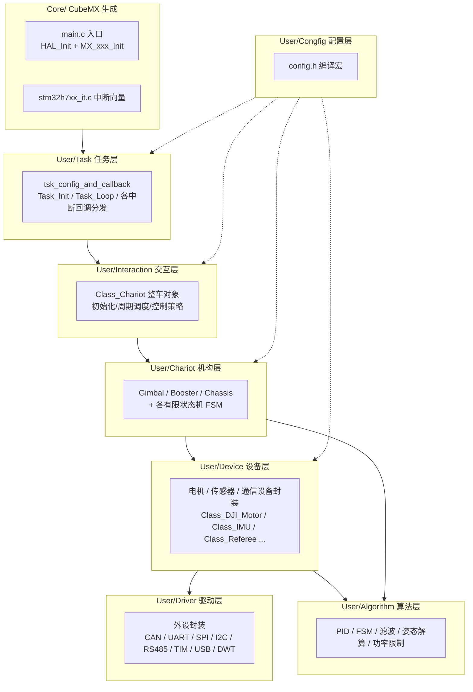
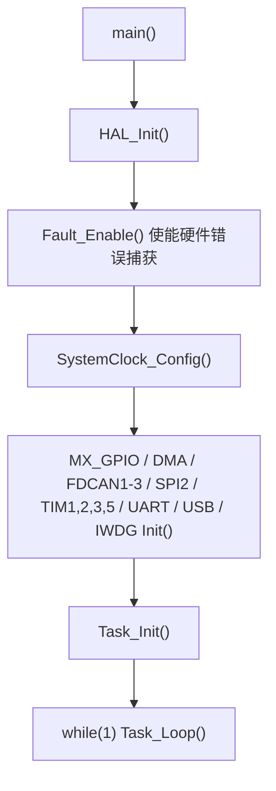
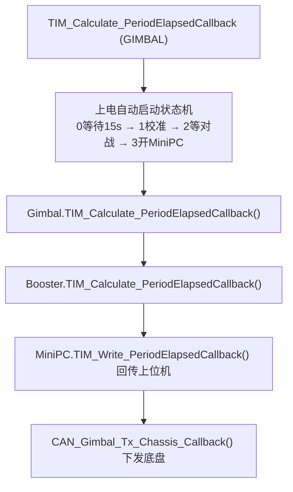

# ZLLC_2026_Dart 项目代码结构文档

> 本文档面向后续维护者与 AI 助手，目标是**快速、详尽**地建立对整份代码的认知：分层架构、每个文件是干什么的、模块之间怎么协作、改代码时要注意什么。
>
> 详细到「状态机逐状态」的 Booster / Gimbal 流程说明见同目录《ZLLC_2026_Dart代码结构文档.md》（本仓库 `Docs/chariot_booster_gimbal_flow.md` 也有同名备份）。本文档是它的**上层总览**，覆盖整个工程，不重复逐状态细节。

---

## 1. 项目概况

| 项 | 内容 |
| --- | --- |
| 主控 | STM32H723VGTx（Cortex-M7，H7 系列，双核之一单核使用） |
| 系统类型 | **裸机**（无 RTOS）：`main()` 死循环 + 定时器中断（TIM5 1ms）驱动周期任务 |
| 工具链 | Keil MDK（`MDK-ARM/ZLLC_2026.uvprojx`），另附 Makefile / EIDE / VSCode 辅助配置 |
| 工程生成 | STM32CubeMX（`ZLLC_2026.ioc`），`Core/` 为自动生成代码 |
| 代码框架 | 基于 **USTC-ROBOWALKER（yssickjgd）** 26 赛季框架，ZLLC 战队二次开发 |
| 项目性质 | RoboMaster 飞镖机器人（发射机构 Dart + 云台 Gimbal + 底盘 Chassis） |
| 编译角色 | `config.h` 里 `#define GIMBAL`（当前只编译云台/发射机构这个板子，底盘板为另一套固件） |

**核心文档线索**：根目录 `版本说明.md`（迭代历史/已知 bug 记录，非常有价值）、`技术日志.md`（早期硬件踩坑）。

---

## 2. 分层架构总览

代码按依赖从底到顶分为 8 层。上层只依赖下层，通过 `Init` 注入 + 回调函数绑定。



**一句话概括每层**：

- **Core/**：CubeMX 生成，负责时钟、外设初始化、中断入口，基本不手改（改也只改 `USER CODE` 区）。
- **User/Task**：把中断回调（CAN/UART/SPI/USB/定时器）分发给具体对象，并暴露 `Task_Init` / `Task_Loop` 给 `main()`。
- **User/Interaction**：`Class_Chariot` 是唯一全局整车对象，`Init()` 里组装所有模块并绑定指针，`TIM_Calculate_PeriodElapsedCallback()` 是 1ms 周期主调度。
- **User/Chariot**：三大机构（云台/发射/底盘）的业务逻辑，内部用 `Class_FSM` 派生状态机实现校准、发射、换弹等时序。
- **User/Device**：把真实外设（大疆/达妙/瓴控电机、BMI088 IMU、裁判系统、DR16/VT13 遥控、拉力计、舵机、超电、蜂鸣器、MiniPC）封装成类。
- **User/Driver**：把 STM32 外设（FDCAN/USART/SPI/I2C/TIM/USB/RS485/DWT）封装成「管理对象 + 回调」的统一模板。
- **User/Algorithm**：纯算法，无硬件依赖（PID、有限状态机、滤波、姿态解算、功率限制、斜坡等）。
- **User/Congfig**：`config.h` 用宏切换板子角色、调试/比赛、遥控器型号、兵种/底盘类型。

---

## 3. 编译配置（config.h 开关）

文件：`User/Congfig/Inc/config.h`。当前生效项：

```cpp
//#define CHASSIS        // 底盘板（未启用）
#define GIMBAL          // 云台+发射机构板（当前启用）
#define DEBUG           // 调试模式
//#define USE_VT13       // VT13 遥控器（未启用）
#define USE_DR16        // DR16 遥控器（当前启用）
//#define AGV / OMNI_WHEEL / INFANTRY / HERO / SENTRY   // 兵种/底盘（均未启用）
```

- `CHASSIS` 与 `GIMBAL` 二选一，决定 `Class_Chariot`、`Task_Init`、CAN/UART 回调里编译哪一套代码。
- `DEBUG` 影响遥控器离线保护逻辑（DEBUG 下不看裁判系统 `game_process`，直接按遥控器在线状态判断）。
- `USE_DR16` / `USE_VT13` 二选一，选择手控输入源。

> 改代码时先确认你改的是 `GIMBAL` 分支还是 `CHASSIS` 分支，两者代码在 `#ifdef CHASSIS / #elif defined(GIMBAL)` 中大量并存。

---

## 4. 程序启动与调度主链路

### 4.1 启动流程



- `Fault_Enable()` 来自 `User/Driver/fault_handler`，配合 `stm32h7xx_it.c` 里的 Fault handler 捕获 HardFault 现场，方便 Ozone 定位。
- `Task_Init()` 里完成：驱动层初始化（`CAN_Init` / `UART_Init` / `SPI_Init` / `RS485_Init` / `USB_Init`）→ 定时器注册（`TIM_Init(&htim5, Task1ms_TIM5_Callback)`）→ `chariot.Init()`（交互层组装所有设备对象）→ `HAL_TIM_Base_Start_IT(&htim5)` 开启调度。

### 4.2 周期任务（TIM5 1ms 中断）

`Task1ms_TIM5_Callback()`（`User/Task/Src/tsk_config_and_callback.cpp`）是 1ms 心跳，做四件事：

1. `chariot.TIM1msMod50_Alive_PeriodElapsedCallback()` —— 50ms 一次的设备在线检测。
2. `HAL_IWDG_Refresh()` —— 喂狗。
3. `chariot.TIM_Calculate_PeriodElapsedCallback()` —— 主控逻辑（见下）。
4. 统一发送：`TIM_CAN_PeriodElapsedCallback()`（CAN 打包发送）、`TIM_RS485_PeriodElapsedCallback()`（拉力计轮询），以及分频的 `TIM_USB_PeriodElapsedCallback()` / `TIM_UART_PeriodElapsedCallback()`。

> 上电后 `init_finished` 计数到 2000 才置 `start_flag=1`，即**上电约 2 秒后才开始跑主逻辑**，等各模块稳定。

### 4.3 整车主调度（GIMBAL 分支）

`Class_Chariot::TIM_Calculate_PeriodElapsedCallback()`（`User/Interaction/Src/ita_chariot.cpp`）：



上电自动启动状态机（关键时序）：

| 状态 | 动作 | 跳转条件 |
| --- | --- | --- |
| 0 | 等待 15s 让模块稳定 | 满 15s → 1 |
| 1 | `enable_yaw_calibration=1`、`enable_booster_flag=1` 同时启动校准 | Yaw 校准完成 && Push/Pull 校准完成 → 2 |
| 2 | 等待裁判系统 | `Referee.Get_Game_Stage() == BATTLE` → 3 |
| 3 | `minipc_flag=1`，云台切 MiniPC 速度控制 | 保持 |

控制逻辑入口 `TIM_Control_Callback()`（在 DR16/VT13 串口回调里触发）→ `Control_Chassis / Control_Gimbal / Control_Booster`，处理遥控器拨杆切换控制模式（NORMAL / MINIPC / 校准）。

---

## 5. 各层文件索引（逐文件一句话）

### 5.1 Core/（CubeMX 生成，外设初始化）

| 文件 | 说明 |
| --- | --- |
| `main.c` | 入口：初始化 + 调 `Task_Init` / `Task_Loop` |
| `stm32h7xx_it.c` | 中断服务函数，Fault handler 跳转 `Fault_Capture` |
| `gpio.c` / `dma.c` / `fdcan.c` / `spi.c` / `tim.c` / `usart.c` / `iwdg.c` | 各外设 `MX_xxx_Init`（FDCAN1/2/3、SPI2、TIM1/2/3/5、UART/USART、IWDG1、DMA） |
| `system_stm32h7xx.c` / `stm32h7xx_hal_msp.c` | 系统初始化 / MSP 引脚复用 |
| `main.h` | 引脚宏（BMI088 片选 `CS1_ACCEL/CS1_GYRO` 等） |
| `memorymap.c/.h` | 空壳（CubeMX 生成的占位，无实际逻辑） |

### 5.2 User/Task 任务层

| 文件 | 说明 |
| --- | --- |
| `tsk_config_and_callback.h` | 声明 `Task_Init` / `Task_Loop` |
| `tsk_config_and_callback.cpp` | 全局对象 `Class_Chariot chariot`；**所有中断回调**（CAN/UART/SPI/RS485/USB/TIM）的定义与分发；`Task_Init` / `Task1ms_TIM5_Callback` |

### 5.3 User/Interaction 交互层

| 文件 | 说明 |
| --- | --- |
| `ita_chariot.h` | `Class_Chariot` 声明 + 通讯/控制/状态枚举 + `Class_FSM_Alive_Control`（遥控器离线保护状态机） |
| `ita_chariot.cpp` | 整车 `Init`、`TIM_Calculate_PeriodElapsedCallback`（主调度+上电启动状态机）、`TIM_Control_Callback`、CAN 底盘↔云台收发、在线检测 |

### 5.4 User/Chariot 机构层

| 文件 | 说明 |
| --- | --- |
| `crt_booster.h/.cpp` | **发射机构**：`Class_Booster` + `Class_FSM_Shooting`（发射）/ `Class_FSM_Reload`（换弹，已废弃未调度）/ `Class_FSM_Push_Calibration` / `Class_FSM_Pull_Calibration`（详见专项文档） |
| `crt_gimbal.h/.cpp` | **云台**：`Class_Gimbal` + `Class_FSM_Yaw_Calibration`；Yaw 丝杆标定、MiniPC 速度环、发射期冻结（详见专项文档） |
| `crt_chassis.h/.cpp` | **底盘**：`Class_Tricycle_Chassis` 三轮全向/舵轮底盘，`Class_Power_Limit` 功率限制，斜坡加减速，随动环（当前 GIMBAL 编译下仅保留对象不实际驱动） |

### 5.5 User/Device 设备层

| 文件 | 封装设备 | 通信 | 关键类 |
| --- | --- | --- | --- |
| `dvc_djimotor.h/.cpp` | 大疆电机 GM6020 / C610 / C620(含 M3508) / C620_Steer | FDCAN | `Class_DJI_Motor_GM6020 / _C610 / _C620 / _C620_Steer` |
| `dvc_dmmotor.h/.cpp` | 达妙电机 J4310 | FDCAN | `Class_DM_Motor_J4310` |
| `dvc_lkmotor.h/.cpp` | 瓴控电机 MS/MF/MH/MG | FDCAN | `Class_LK_Motor` |
| `dvc_minipc.h/.cpp` | 上位机 MiniPC（自瞄/状态回传） | USB / UART / CAN | `Class_MiniPC` |
| `dvc_referee.h/.cpp` | 裁判系统 PM01（比赛/血量/功率/位置/飞镖指令/UI） | UART | `Class_Referee` |
| `dvc_dr16.h/.cpp` | DR16 遥控器 + 图传键鼠 | UART | `Class_DR16` |
| `dvc_VT13.h/.cpp` | VT13 遥控器 | UART | `Class_VT13` |
| `dvc_imu.h/.cpp` | 姿态解算（融合 BMI088） | SPI | `Class_IMU` |
| `dvc_boardc_bmi088.h/.cpp` | BMI088 六轴 IMU 传感器 | SPI | `Class_BoardC_BMI` |
| `dvc_boardc_bmi088_reg.h` | BMI088 寄存器宏（无 .cpp） | — | — |
| `dvc_TensionMeter.h/.cpp` | 拉力计（GYSA，Modbus-RTU） | RS485 | `Class_TensionMeter` |
| `dvc_servo.h/.cpp` | PWM 舵机 | PWM | `Class_Servo` |
| `dvc_supercap.h/.cpp` | 超级电容（底盘能量缓冲） | FDCAN / UART | `Class_Supercap` |
| `dvc_buzzer.h/.cpp` | 蜂鸣器（多优先级乐谱） | PWM | `Class_Buzzer` 等 |
| `dvc_GraphicsSendTask.h/.cpp` | 裁判系统客户端 UI 绘制 | UART | C 函数集 |
| `dvc_dwt.h/.cpp` | DWT 计时/延时 | — | C 函数 |

### 5.6 User/Driver 驱动层

| 文件 | 封装外设 | 关键对象/函数 |
| --- | --- | --- |
| `drv_can.h/.cpp` | FDCAN1/2/3 | `CAN1/2/3_Manage_Object`、`CAN_Init`、`CAN_Send_Data`、`TIM_CAN_PeriodElapsedCallback` |
| `drv_uart.h/.cpp` | USART/UART 1~10（DMA+空闲中断） | `UART1~10_Manage_Object`、`UART_Init`、`TIM_UART_PeriodElapsedCallback` |
| `drv_tim.h/.cpp` | TIM 定时器统一调度 | `TIM_Init`、`HAL_TIM_PeriodElapsedCallback` 分发 |
| `drv_rs485.h/.cpp` | USART2 RS485（拉力计） | `RS485_Init` / `RS485_Send_DMA` / `TIM_RS485_PeriodElapsedCallback` |
| `drv_spi.h/.cpp` | SPI1/2/3 | `SPI_Manage_Object`、`SPI_Init`、`SPI_Send_Receive_Data` |
| `drv_i2c.h/.cpp` | I2C1/2/3 | `IIC_Manage_Object`、`IIC_Init` |
| `drv_usb.h/.cpp` | USB CDC 虚拟串口 | `MiniPC_USB_Manage_Object`、`TIM_USB_PeriodElapsedCallback` |
| `drv_dwt.h/.cpp` | DWT 周期计数器初始化 | `DWT_Init`、`SysTime` |
| `drv_cache.h` | H7 D-Cache 一致性（纯头文件） | `DCache_Clean/Invalidate_IfEnabled` |
| `drv_math.h/.cpp` | 数学工具（映射/限幅/角度归一化/sinc） | `Math_Int_To_Float` 等 |
| `fault_handler.h/.c` | HardFault 现场捕获 | `Fault_Enable` / `Fault_Capture` |
| `drv_adc.h/.cpp` | ADC（**已废弃，全注释**） | — |
| `drv_bsp-boarda.h/.cpp` | A 板 BSP（**已废弃，全注释**） | — |

### 5.7 User/Algorithm 算法层

| 文件 | 算法 | 关键类/函数 | 使用方 |
| --- | --- | --- | --- |
| `alg_pid.h/.cpp` | 位置式 PID（微分先行/积分分离/前馈/死区） | `Class_PID` | 电机、底盘随动、IMU 温控（**主力 PID**） |
| `PID.h/.cpp` | RM 风格 PID+前馈（模糊/LDOB/TD 未实现） | `PID_t`、`Feedforward_t` | 备用，当前未接线 |
| `alg_fsm.h/.cpp` | 有限状态机基类 | `Class_FSM` | booster/gimbal/ita 所有状态机的父类 |
| `alg_filter.h/.cpp` | FIR / 卡尔曼 / 中值/滑动滤波 | `Class_Filter_*`、`SpikeFilter` | 电机角速度滤波 |
| `alg_slope.h/.cpp` | 斜坡加减速 | `Class_Slope` | 底盘三方向速度平滑 |
| `alg_power_limit.h/.cpp` | 底盘功率限制（功率模型求根） | `Class_Power_Limit` | 底盘 |
| `alg_SMC_Control.h/.cpp` | 滑模控制（GM6020） | `Class_SMC` | GM6020 云台电机 |
| `alg_MahonyAHRS.h/.cpp` | Mahony 互补滤波姿态 | `Class_MahonyAHRS` | IMU（当前未走此路径） |
| `QuaternionEKF.h/.cpp` | 四元数 EKF 姿态+陀螺零偏 | `QEKF_INS`、`IMU_QuaternionEKF_Update` | IMU（**实际使用**） |
| `kalman_filter.h/.cpp` | 矩阵卡尔曼 / 1D 卡尔曼 | `KalmanFilter_t`、`kalman_update` | QuaternionEKF、电机 |
| `Matrix.hpp` | 矩阵/向量模板（封装 CMSIS-DSP） | `Matrixf<r,c>` | RLS |
| `RLS.hpp` | 递推最小二乘（遗忘因子） | `RLS<dim>` | 备用，当前未接线 |
| `user_lib.h/.cpp` | 通用数学/工具 + OLS 最小二乘 | `ramp_calc`、`OLS_*` | PID 等 |

---

## 6. 通信总线与关键 CAN/UART 通道

### 6.1 CAN 总线（FDCAN1/2/3）

| 总线 | 用途（GIMBAL 板） | 关键 ID |
| --- | --- | --- |
| CAN1 | 发射机构电机 | 0x201 Pull、0x202 Push_L、0x203 Push_R、0x205 Reload_Angle(GM6020) |
| CAN2 | 云台电机 | 0x201 Yaw、0x202 Pitch_L、0x203 Pitch_R |
| CAN3 | 上位机 MiniPC / 底盘通讯 | 0x106 MiniPC 收；0x77/0x95 底盘↔云台 |

### 6.2 UART 通道

| UART | 用途 |
| --- | --- |
| USART1 / UART10 | 裁判系统（CHASSIS 用 10，GIMBAL 用 1） |
| UART5 | DR16 遥控器 |
| UART9 | VT13（备用） |
| UART8 | MiniPC 串口通道（上位机） |
| USART2 | RS485 → 拉力计 |
| USB CDC | MiniPC USB 通道 |

---

## 7. 关键全局对象与跨模块标志

### 7.1 全局对象

- `Class_Chariot chariot`（`tsk_config_and_callback.cpp`）：唯一整车对象，一切模块都挂在它下面。
  - `chariot.Gimbal`（云台）、`chariot.Booster`（发射）、`chariot.Chassis`（底盘）、`chariot.MiniPC`、`chariot.Referee`、`chariot.DR16` / `VT13`。

### 7.2 跨模块标志（跨文件 extern）

| 标志 | 定义处 | 含义 |
| --- | --- | --- |
| `enable_booster_flag` | `crt_booster.cpp` | 发射机构总使能，控制校准+发射状态机 |
| `enable_yaw_calibration` | `crt_gimbal.cpp` | 允许 Yaw 校准状态机 |
| `minipc_flag` | `crt_gimbal.cpp` | 校准完成后是否切入 MiniPC 模式 |
| `Referee_Allow_Shoot` | `crt_booster.cpp` | 发射许可位（同时让 Gimbal 冻结 Yaw） |
| `Push_Calibration_Finished` / `Pull_Calibration_Finished` | `crt_booster.cpp` | Push/Pull 校准完成标志 |
| `CAN3_Chassis_Rx_Data_A` 等 | `ita_chariot.cpp` | 底盘发来的裁判系统数据（含 `game_process`） |

> 这些标志的详细流转见专项文档《ZLLC_2026_Dart代码结构文档.md》。

---

## 8. 设计约定与命名规范

项目沿用框架的**对象三分法**（见 `tsk_config_and_callback.cpp` 头部注释）：

- **专属对象（Specialized）**：上层独享、全局唯一，如 `Class_Chariot` 里的 `Gimbal`/`Booster`，直接封在上层类里。
- **同类可复用对象（Reusable）**：各调各的，如电机对象、PID 对象，在最近的上层类里初始化。
- **通用对象（Generic）**：多处共用，用**指针**注入，如 `Class_Referee*`、`Class_MiniPC*`（Booster 和 Gimbal 都持有 `MiniPC` 指针）。

**命名前缀约定**：
- 目录前缀：`crt_`（机构/Chariot）、`dvc_`（设备/Device）、`drv_`（驱动/Driver）、`alg_`（算法/Algorithm）、`ita_`（交互/Interaction）、`tsk_`（任务/Task）。
- 类名：`Class_` + 模块名（`Class_Booster`、`Class_IMU`）。
- 周期回调：`TIM_xxx_PeriodElapsedCallback()` 统一命名，1ms 主周期、`TIM1msMod50_` 为 50ms 分频、`Alive_` 为在线检测。
- 状态机：继承 `Class_FSM`，回调 `xxx_TIM_Status_PeriodElapsedCallback()`。

---

## 9. 修改代码时的注意事项（踩坑清单）

1. **分清板子角色**：大量 `#ifdef CHASSIS / #elif defined(GIMBAL)`，改动前确认改对分支；当前只编 GIMBAL。

2. **发射时序**：换弹已整合进 `Class_FSM_Shooting::Shooting_TIM_Status_PeriodElapsedCallback()` 大状态机；`Class_FSM_Reload` 是上版本残留，别改错对象。

3. **拉力闭环未启用**：PREP_FIRE 的 Task C 走位置环，`Pull_Tension_Control()` 被注释。若要恢复需同步核对 `Target_Tension`、拉力计单位、稳定阈值。

4. **`Referee_Allow_Shoot` 双模块共享**：Booster（触发发射）和 Gimbal（冻结 Yaw）都读它，改动置位/清零要两边一起看。

5. **Pitch 电机无输出但别删**：`Motor_Pitch_L/R` 仍被 CAN 接收和 Alive 检测访问；删除要删彻底。

6. **H7 Cache 一致性**：DMA 收发前后要 `DCache_Clean/Invalidate`（`drv_cache.h`）。历史 hardfault 就是 D-Cache 没开却调用了 `SCB_InvalidateDCache_by_Addr` 导致（见 `版本说明.md` 2026.5.19）。

7. **已废弃文件**：`drv_adc`、`drv_bsp-boarda` 全注释；`alg_filter` 的 Fourier/Kalman、`PID.h` 的模糊/LDOB/TD、`RLS.hpp` 当前未接线，属备用/历史代码。

8. **编译**：根目录 `make -j4` 会报 `No targets`，实际用 Keil MDK 编译；Makefile 规则不完整，不要依赖它验证。

9. **上电时序**：`start_flag` 需上电 2s 后置位；自动启动状态机先等 15s 才校准；改启动时序注意这两处延时。

---

## 10. 快速定位指南

| 想改什么 | 去哪里 |
| --- | --- |
| 发射/换弹/校准时序 | `User/Chariot/Src/crt_booster.cpp`（+ 专项文档） |
| 云台 Yaw 控制/校准/MiniPC | `User/Chariot/Src/crt_gimbal.cpp`（+ 专项文档） |
| 整车调度/上电启动/控制模式切换 | `User/Interaction/Src/ita_chariot.cpp` |
| 中断回调绑定/新增外设 | `User/Task/Src/tsk_config_and_callback.cpp` |
| 电机 PID 参数/控制方式 | `User/Device/Src/dvc_djimotor.cpp`、`dvc_dmmotor.cpp`、`dvc_lkmotor.cpp` |
| 上位机 MiniPC 协议 | `User/Device/Src/dvc_minipc.cpp` |
| 裁判系统协议/UI | `User/Device/Src/dvc_referee.cpp`、`dvc_GraphicsSendTask.cpp` |
| 拉力计 Modbus | `User/Device/Src/dvc_TensionMeter.cpp` + `drv_rs485.cpp` |
| 姿态解算 | `User/Device/Src/dvc_imu.cpp` + `QuaternionEKF.cpp` |
| 编译宏/板子角色 | `User/Congfig/Inc/config.h` |
| 历史 bug 与迭代记录 | 根目录 `版本说明.md` |
